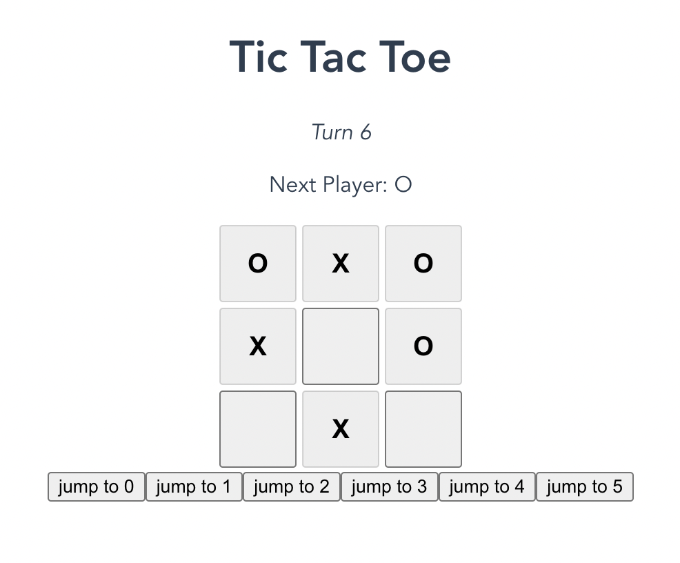
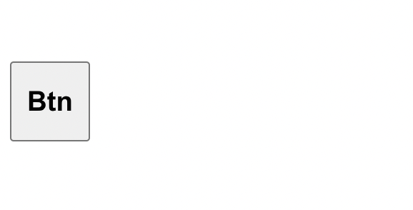
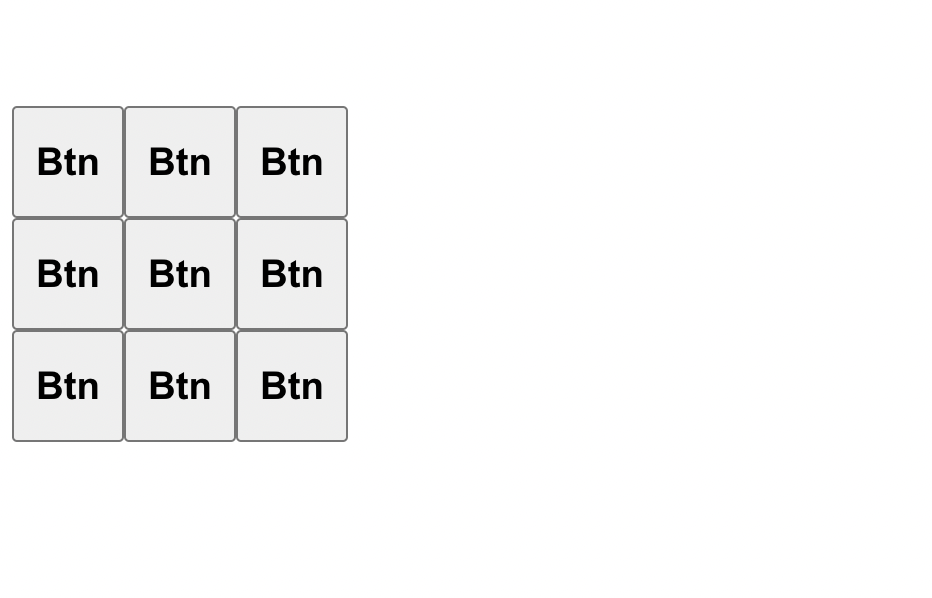
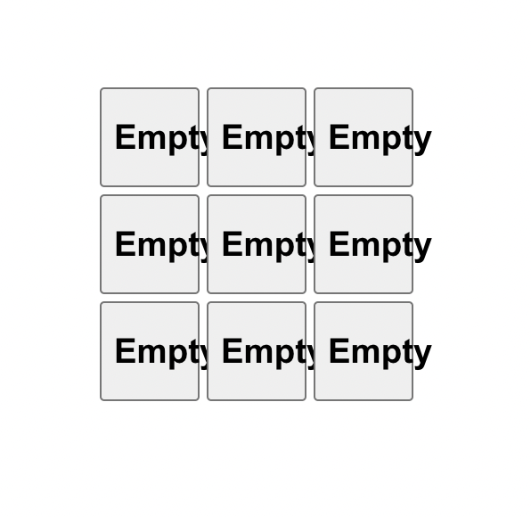
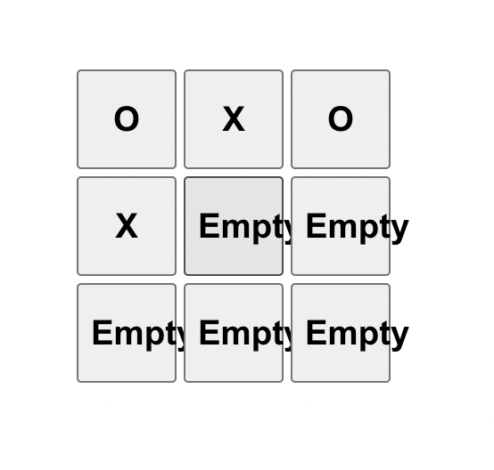
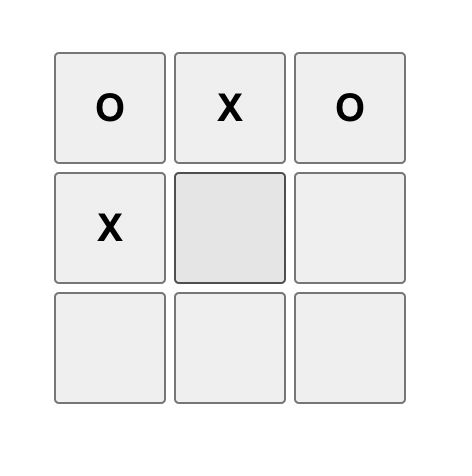

# Tic-Tac-Toe Tutorial in Scala

This is a port of [Tic-Tac-Toe React tutorial](https://beta.reactjs.org/learn/tutorial-tic-tac-toe) with following Scala stack:

* [Scala.js](https://www.scala-js.org/)
* [sbt](https://www.scala-sbt.org/)
* [Vite](https://vitejs.dev/)
* [Laminar](https://laminar.dev/)


You will build a small tic-tac-toe game during this tutorial.
You can see what it will look like when you’re finished here:

https://i10416.github.io/tictactoe/




## Install

You need to explicitly install the following software:

* sbt, as part of [getting started with Scala](https://docs.scala-lang.org/getting-started/index.html) (or if you prefer, through [its standalone download](https://www.scala-sbt.org/download.html))
* [Node.js](https://nodejs.org/en/)

Other software will be downloaded automatically by the commands below.

## Prepare

Before doing anything, including before importing in an IDE, run

```
$ npm install
```

## Development

Open two terminals.
In the first one, start `sbt` and, within, continuously build the Scala.js project:

```
$ sbt
...
> ~fastLinkJS
...
```

In the second one, start the Vite development server with

```
$ npm run dev
...
```

Follow the URL presented to you by Vite to open the application.

You can now continuously edit the `Main.scala` file, and Vite will automatically reload the page on save.

## Production build

Make a production build with

```
$ npm run build
```

You can then find the built files in the `dist/` directory.
You will need an HTTP server, such as `python3 -m http.server`, to open the files, as Vite rewrites `<script>` tags to prevent cross-origin requests.


## Tic Tac Toe Tutorial

```sh
git clone https://github.com/i10416/tictactoe
cd tictactoe
```

First, look at the entrypoint at `src/main/scala/tictactoe/Index.scala`.


`renderOnDomContentLoaded` function binds Laminar HTML element to real DOM element.

```scala
package tictactoe
import com.raquo.laminar.api.L.{*, given}
import org.scalajs.dom

@main def program =
  renderOnDomContentLoaded(
    dom.document.getElementById("app"),
    Game.layout
  )
```

Now, replace `Game.layout` with `p("Hello, Laminar")` and run `sbt ~fastLinkJS`, `npm run dev`, then open http://localhost:3000

You will find `Hello, Laminar` message like this.


There is a reference impelementation in `src/main/scala/tictactoe/TicTacToe.scala` and `Game.layout` comes from there. When you get stuck, look at `TicTacToe.scala` and check how it changes when you modify it.

Next, We create a cell component of Tic Tac Toe board.

```scala

object Square:
  def apply() = button("Btn")
```

`button("Btn")` is equivalent to `<button>Btn</button>` HTML.  Laminar supports other HTML tags such as `h1`~`h6`, `div` or `p` too.

Laminar's HTML elements take `Modifier[ReactiveHtmlElement[HTMLButtonElement]]` as  varargs. `Modifier` may be other HTML element, `child` or `children` element(s), style or other HTML attributes or event handler such as `onClick` or `onBlur`.


```scala
@main def program =
  renderOnDomContentLoaded(
    dom.document.getElementById("app"),
    button(
      "Btn",
      fontSize.larger,
      width("56px"),
      height("56px"),
      display.block,
      color.black,
      fontWeight.bold
    )
  )
```

For example, the code above is rendered as following.



The code bellow displays buttons in 3 x 3 grid. Each button should show one of " ", "O" or "X" according to state, but we put "Btn" as a placeholder for now.

```scala
@main def program =
  renderOnDomContentLoaded(
    dom.document.getElementById("app"),
    div(
      List
        .tabulate(9)(identity)
        .grouped(3)
        .map(
          _.map(_ =>
            button(
              "Btn",
              fontSize.larger,
              width("56px"),
              height("56px"),
              display.block,
              color.black,
              fontWeight.bold
            )
          )
        )
        .map(div(_).amend(display.flex))
        .toList
    )
  )

```

You can easily create 3 x 3 grid with Scala's collection combinators(`map`, `grouped`, etc.)



You may notice that there is fancy syntax; `.amend(display.flex)`. `amend` and `amendThis` are helper methods that allow us to provide additional properties to HTML elements. `amend` takes `Modifier` as does `HTMLEmement#apply`.

For now, you have not use any stateful component at all. However, we cannot do without state management in most of modern frontend application development.

In this tutorial, you use mainly two state management API from Laminar. One is `Var[T]` and the other is `EventBus[T]`.

`Var` is a _reactive_ value that notifies the value changes to its listeners. This feature is useful to track state and propagate it to UI. 

In Tic Rac Toe, each cell in game board starts with `Empty` and Two player(`O` and `X`) choose a cell in turn and fill it with his/her mark(`O` or `X`), so we also need to track player turn.


```scala
enum Cell:
  case Empty
  case X
  case O

object Game:
  val turn = Var(0)
  val board = Var(Seq.fill(9)(Cell.Empty))
```

Let's implement interactive UI.

Tic-Tac-Toe UI must satisfy the following specs.

1. when player `O` clicks the empty cell, cell is turned into `O`, and when `X` does, cell is turned into `X`.
2. once  `X` or `O` is set to a cell, player cannot modify the cell.
3. when `board` state changes, board UI immediately reflects the change.


First, we get signal from `Var` and transform it into HTML elements. `children` property in HTML element can subscribe reactive signal using `<--`. 

In genral, `<--` binds reactive value to an element whereas `:=` assigns value to an element. For example, `button` with `disabled <-- intSignal.map(_ % 2 == 0)` listens intSignal changes and is re-rendered every time `intSignal` changes from odd to even or from even to odd, but `button` with `disabled := <value from constructor>` won't change until its ascendant element is rendered again.

Let's map state value to UI. It is not so difficult. Pay attention aroung `div(children <-- Game.cells)` and `board.signal..map(...)`.

```scala
@main def program =
  renderOnDomContentLoaded(
    dom.document.getElementById("app"),
    div(children <-- Game.cells)
  )

object Game:
  val turn = Var(0)
  val board = Var(Seq.fill(9)(Cell.Empty))
  object Square:
    def apply(loc: Int, cell: Cell) =
       div(
         button(
           cell.toString(),
         ).amend(
           fontSize.larger,
           width("56px"),
           height("56px"),
           display.block,
           color.black,
           fontWeight.bold
         ),
         padding("2px")
       )

  val cells = board.signal
    .map(state =>
      state.zipWithIndex
        .map((cell, loc) => Square(loc, cell))
        .grouped(3)
        .map(
          div(_).amend(
            display.flex,
            justifyContent.center,
            flexWrap.nowrap
          )
        )
        .toSeq
    )
```



At this point, you cannot change cell state yet :(

To change cell state, you have to set `onClick` event handler and define how to mutate board state.


First, we define `Cmd` as enum so that compiler can exhaustive match clauses.

```scala
enum Cmd:
  case Choose(loc: Int)
```

Then, we create `Observer`, which recieves `Cmd` and mutate states.
```scala
  val obs: Observer[Cmd] = Observer[Cmd] {
    case Cmd.Choose(loc) =>
      val t = turn.now()
      board.now()(loc) match
        case Cell.Empty =>
          // replace element at loc
          board.update(state =>
            val (leading, _ +: trailing) = state.splitAt(loc): @unchecked
            (leading :+ (if turn % 2 == 0 then Cell.O
                                      else Cell.X)) ++ trailing
          )
          turn.update(_ + 1)
        case _ => ()
    case _ => ()
  }
```

Finally, we dispatch `Choose` event from `Square` to `Observer` using `-->` operator.

```scala
  object Square:
    def apply(loc: Int, cell: Cell) =
       div(
         button(
           cell.toString(),
           onClick
             .filter(_ => cell == Cell.Empty)
             .mapTo(Cmd.Choose(loc)) --> obs
         ).amend(
           fontSize.larger,
           width("56px"),
           height("56px"),
           display.block,
           color.black,
           fontWeight.bold
         ),
         padding("2px")
       )
```

When you click an empty cell, it dispatches `Cmd.Choose` event to `Observer`, then `Observer` mutates board and turn state. On state changes, `Var` emits signal that invokes re-rendering of listeners(in this example `div(children <-- Game.cells)` is refreshed).

```scala
@main def program =
  renderOnDomContentLoaded(
    dom.document.getElementById("app"),
    div(children <-- Game.cells)
  )

object Game:
  val turn = Var(0)
  val board = Var(Seq.fill(9)(Cell.Empty))
  object Square:
    def apply(loc: Int, cell: Cell) =
       div(
         button(
           cell.toString(),
           onClick
             // prevent onClick event when cell is not empty.
             .filter(_ => cell == Cell.Empty)
             .mapTo(Cmd.Choose(loc)) --> obs
         ).amend(
           fontSize.larger,
           width("56px"),
           height("56px"),
           display.block,
           color.black,
           fontWeight.bold
         ),
         padding("2px")
       )

  val cells = board.signal
    .map(state =>
      state.zipWithIndex
        .map((cell, loc) => Square(loc, cell))
        .grouped(3)
        .map(
          div(_).amend(
            display.flex,
            justifyContent.center,
            flexWrap.nowrap
          )
        )
        .toSeq
    )
  val obs: Observer[Cmd] = Observer[Cmd] {
    case Cmd.Choose(loc) =>
      val t = turn.now()
      board.now()(loc) match
        case Cell.Empty =>
          // replace element at loc
          board.update(state =>
            val (leading, _ +: trailing) = state.splitAt(loc): @unchecked
            (leading :+ (if t % 2 == 0 then Cell.O
                                      else Cell.X)) ++ trailing
          )
          turn.update(_ + 1)
        case _ => ()
    case _ => ()
  }
```



`Empty` cell does not look nice, so we define a helper method that pretty print `Cell`.

```scala
object Cell:
  extension (cell: Cell)
    def show: String = cell match
      case Empty => ""
      case X     => "X"
      case O     => "O"
```

And replace `cell.toString()` with `cell.show`.

```scala
  object Square:
    def apply(loc: Int, cell: Cell) =
       div(
         button(
           cell.show,
```




Current implementation lacks the following features.

- detect the winner
- restore histories
- fancy UI

Let's implement them one by one. 


```scala
  def check(board: Seq[Cell]) =
    val lines = Seq(
      (0, 1, 2),
      (3, 4, 5),
      (6, 7, 8),
      (0, 3, 6),
      (1, 4, 7),
      (2, 5, 8),
      (0, 4, 8),
      (2, 4, 6)
    )
    lines.find { (a, b, c) =>
      (board(a), board(b), board(c)) match
        case (Cell.O, Cell.O, Cell.O) | (Cell.X, Cell.X, Cell.X) => true
        case _                                                   => false
    }.isDefined
```

We need to replace board state from `Var[Seq[Cell]]` to `Var[Seq[Seq[Cell]]]`. Here, outer `Seq` represents turn and inner `Seq` holds board state at that point.

We also need to lock UI when one player wins, so we introduce another `Var` that holds whether there is a winner.

```scala
val histories = Var(Seq(Seq.fill(9)(Cell.Empty)))
val wonBy: Var[Option[Boolean]] = Var(None)
```

Accordingly, we need to modify observer too.

```scala
 val obs: Observer[Cmd] = Observer[Cmd] {
    case Cmd.Choose(loc) =>
      val turn = turnVar.now()
      val last = histories.now()(turn)
      last(loc) match
        case Cell.Empty =>
          val (leading, _ +: trailing) = last.splitAt(loc): @unchecked
          val present = (leading :+ (if turn % 2 == 0 then Cell.O
                                     else Cell.X)) ++ trailing
          histories.update(_.take(turn + 1) :+ present)
          if check(present) then wonBy.set(Some(turn % 2 == 0))
          turnVar.update(_ + 1)
        case _ => ()
 }
```

Then, we pass a winner argument to `Square` so that we can disable `onClick` handler when there is a winner.

```scala
object Square:
  def apply(loc: Int, cell: Cell, winner: Option[Boolean]) =
    div(
      button(
        cell.show,
        onClick
          .filter(_ => cell == Cell.Empty && winner.isEmpty)
          .mapTo(Cmd.Choose(loc)) --> Game.obs,
        disabled := cell != Cell.Empty
      ).amend(
        fontSize.larger,
        width("56px"),
        height("56px"),
        display.block,
        color.black,
        fontWeight.bold
      ),
      padding("2px")
    )

```

As `Square#apply` signature changes, we need to modify `cells` value too. Now, `cells` subscribes to `wonBy` signal.

```scala
  val cells = turnVar.signal
    .withCurrentValueOf(histories.signal)
    .withCurrentValueOf(wonBy)
    .map((turn, boards, winner) =>
      boards(turn).zipWithIndex
        .map((cell, loc) => Square(loc, cell, winner))
        .grouped(3) // group 3 items into row
        .map(
          div(_).amend(
            display.flex,
            justifyContent.center,
            flexWrap.nowrap
          )
        )
        .toSeq
    )
```